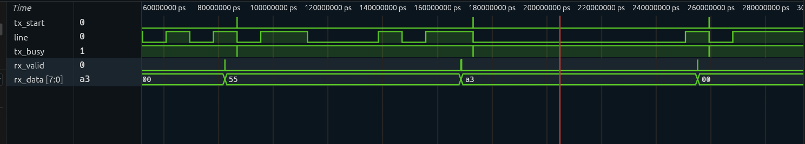

# UART Subsystem in Verilog

A parameterized UART (baud generator, transmitter, and receiver with 16x oversampling) written in Verilog and verified with self-checking testbenches in Icarus Verilog.

**Status:** TX, RX, and TX-to-RX loopback working and passing. FIFOs are in progress (see [Roadmap](#roadmap)).

## What this demonstrates

- FSM design for both a transmitter and a receiver (8N1 frame)
- 16x oversampling with mid-bit sampling and glitch rejection
- Handling an asynchronous input with a 2-FF synchronizer
- Self-checking testbenches (automatic PASS/FAIL, no manual waveform reading)
- Debugging real RTL issues: latches, multiple drivers, level vs. pulse conditions

## Block diagram

```
            tick_16x
 clk ──► baud_gen ──┬──────────────┐
                    ▼              ▼
 tx_data ──► uart_tx ──► line ──► uart_rx ──► rx_data
 tx_start ─►   │                    │   │
               └─► tx_busy          │   ├─► rx_valid
                                    │   └─► framing_err
                          (2-FF synchronizer on rx input)
```

## Modules

| Module | Description |
|---|---|
| `baud_gen` | Divides `clk_freq` to produce a one-clock `tick_16x` pulse, 16 ticks per bit. Parameters: `clk_freq`, `Baud`. |
| `uart_tx` | FSM: IDLE, START, DATA, STOP. 8N1, LSB first. `tx_busy` is high during a frame. |
| `uart_rx` | FSM: IDLE, START, DATA, STOP. Detects the start-bit falling edge, re-checks the line at mid-start-bit (rejects glitches), then samples each bit at its middle. Outputs `rx_valid` and `framing_err` as one-clock pulses. |

## Timing

With `clk_freq = 50 MHz` and `Baud = 115200`:

```
DIV        = 50,000,000 / (115200 x 16) = 27.1  -> truncated to 27
1 bit      = 27 x 16 = 432 clock cycles
actual baud = 50,000,000 / 432 = 115,740  (about 0.47% above target)
```

UART tolerates a few percent of baud error, so this is well within range.

## Project structure

```
rtl/   baud_gen.v  uart_tx.v  uart_rx.v
tb/    tb_baud_gen.v  tb_uart_tx.v  tb_loopback.v
docs/  waveforms/
sim/   build outputs (not tracked by git)
```

## How to run

Requires Icarus Verilog. GTKWave or Surfer is optional, for viewing waveforms.

```bash
# TX test: decodes the TX output the way a receiver would
iverilog -o sim/tx.out rtl/baud_gen.v rtl/uart_tx.v tb/tb_uart_tx.v
vvp sim/tx.out

# Loopback test: TX output wired to RX input
iverilog -o sim/loop.out rtl/baud_gen.v rtl/uart_tx.v rtl/uart_rx.v tb/tb_loopback.v
vvp sim/loop.out
```

Expected output: one `PASS` line per byte, then `TEST PASSED`.

## Verification

| Testbench | What it checks | Result |
|---|---|---|
| `tb_baud_gen` | `tick_16x` is one clock wide and repeats every 27 clocks | Checked in waveform |
| `tb_uart_tx` | Samples `tx` at mid-bit, rebuilds the byte, checks start and stop bits. Bytes: `0x55`, `0xA3`, `0x00`, `0xFF` | PASS |
| `tb_loopback` | TX wired to RX, same four bytes, compared with `!==`. Has a timeout so a hung RX cannot stall the simulation | PASS |

**Not yet tested:** framing-error injection, baud mismatch, back-to-back frames, parity.

## Waveform



Loopback of `0x55`, `0xA3`, `0x00`. Each `tx_start` begins a frame on `line`; after the frame completes, `rx_valid` pulses for one clock and `rx_data` shows the decoded byte.

## Design decisions and bugs I found

| Problem | Cause | Fix |
|---|---|---|
| Shift register shifted many times per bit | `tick_cnt == 15` stays true for about 27 clocks between ticks | Defined `bit_done = tick_16x && (tick_cnt == 15)`, which is true for exactly one clock, and used it in every state |
| Signals behaving unpredictably | `state` and `shreg` were assigned in more than one `always` block | One `always` block owns each `reg` |
| Latches inferred | `if` without `else`, `case` without default | Default value for `next_state` before the `case`; defaults for combinational outputs |
| RX never saw any data | Synchronizer reset polarity was inverted (`if (rst_n)`) | Reset on `~rst_n`, and reset `rx_ff1/rx_ff2` to 1 (idle level) so power-up does not look like a start bit |
| False "good byte" after a bad stop bit | RX STOP mixed "leave STOP" and "was the frame good" in one `rx_ff2` condition | FSM always returns to IDLE after 16 ticks; the datapath alone decides between `rx_valid` and `framing_err` |

## Known limitations

- After a framing error the line is still 0, so RX may treat it as a new start bit (a break signal can retrigger it). Planned fix: IDLE must see the line high before it looks for a start bit.
- No parity support yet.
- Baud divider is truncated, not rounded.

## Roadmap

- [ ] Sync FIFO on the TX side
- [ ] Async FIFO (Gray-code pointers, 2-FF synchronizers) on the RX side
- [ ] Error-injection tests (framing error, baud mismatch)
- [ ] Synthesis results (area, Fmax)
